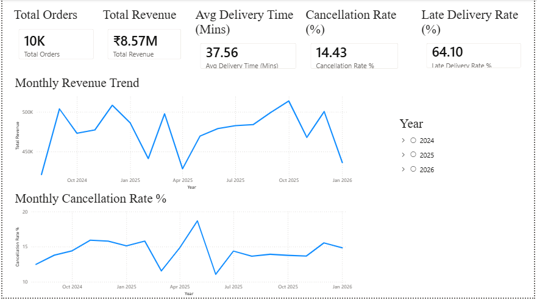
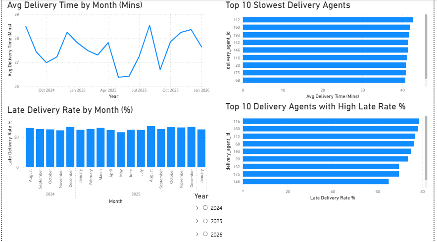
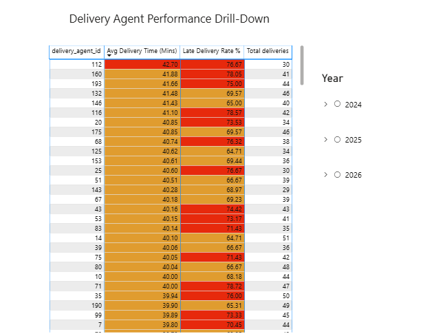
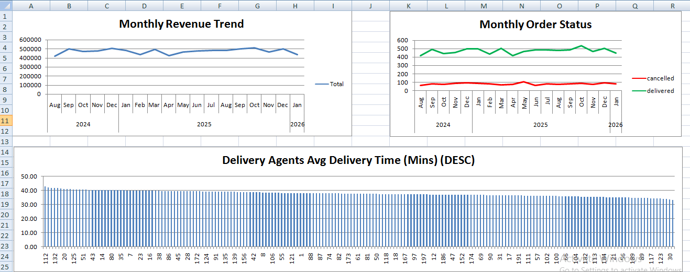
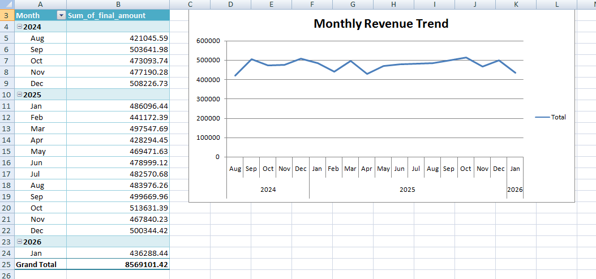
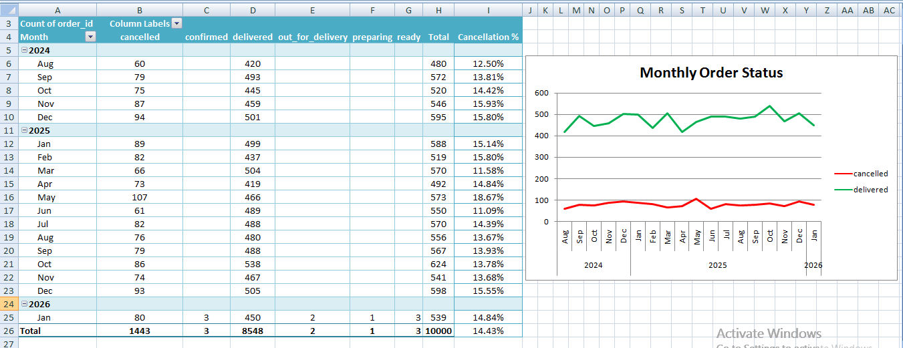
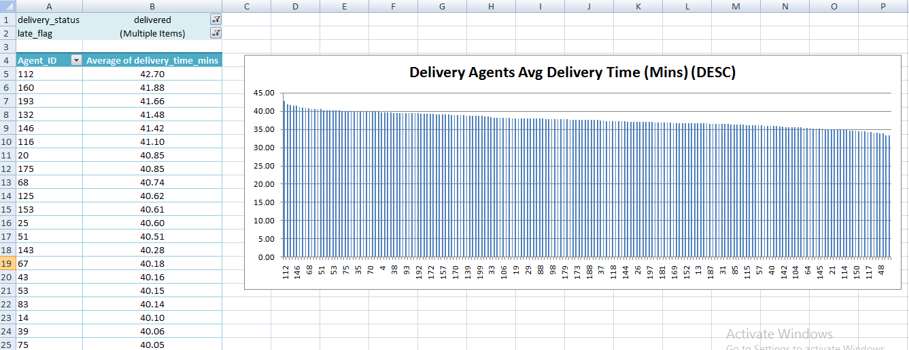

# Food Delivery Data Analysis

This project is an end-to-end data analytics case study for a food delivery platform.  
It analyzes revenue trends, order cancellations, and delivery performance using **PostgreSQL, Python (Pandas), and Power BI** to derive actionable business insights.

## Business Objectives

The analysis aims to answer the following business questions:

- How is revenue trending over time?
- Is the order cancellation rate increasing or decreasing?
- How efficient is the delivery operation?
- Are late deliveries and agent performance impacting customer experience?

## Tech Stack

- **Database**: PostgreSQL  
- **Query Language**: SQL  
- **Programming Language**: Python  
- **Libraries**: Pandas, NumPy, Matplotlib  
- **Visualization**: Power BI, Excel 
- **Version Control**: Git & GitHub

## Project Structure

analysis/
│── 01_data_inspection.py
│── 02_revenue_analysis.py
│── 03_cancellation_analysis.py
│── 04_delivery_performance.py

data/
│── orders.csv
│── deliveries.csv

dashboard/
│── Food Delivery Analysis.pbix

requirements.txt
README.md

## Data Analysis Workflow

1. **Data Inspection**
   - Verified schema, data types, and missing values
   - Ensured data quality before analysis

2. **Revenue Analysis**
   - Monthly revenue trends
   - Comparison of recent vs historical performance

3. **Cancellation Analysis**
   - Overall cancellation rate
   - Monthly cancellation trend analysis

4. **Delivery Performance Analysis**
   - Average delivery time
   - Late delivery rate
   - Identification of underperforming delivery agents

## Key Insights

- Revenue shows a stable trend with moderate growth.
- Order cancellation rate has increased in recent months.
- Average delivery time remains stable (~37–38 minutes).
- Over 60% of deliveries are completed later than the estimated delivery time.
- A small group of delivery agents consistently shows higher delivery times and late delivery rates.

## Power BI Dashboard

The Power BI dashboard consists of three pages:

1. **Executive Overview**
   - Revenue trend
   - Cancellation rate
   - Key delivery KPIs

2. **Delivery Performance**
   - Monthly delivery time trend
   - Late delivery rate by month
   - Top slowest delivery agents

3. **Agent Performance Drill-Down**
   - Agent-level delivery time
   - Late delivery rate
   - Total deliveries with conditional formatting

## Excel Dashboard

An Excel-based operational dashboard was created using Pivot Tables and charts to:

- Track monthly revenue and cancellation trends
- Analyze delivery performance
- Identify underperforming delivery agents

This dashboard provides a quick, lightweight analytical view using Excel alongside Python and Power BI.

## Business Recommendations

- Improve ETA estimation to reduce late delivery perception.
- Identify and retrain underperforming delivery agents.
- Use targeted operational improvements instead of system-wide changes.
- Reducing late deliveries may help lower cancellation rates and improve customer satisfaction.

## Power BI Dashboard (Screenshots)

### Executive Overview


### Delivery Performance


### Agent Performance Drill-Down


## Excel Dashboard (Screenshots)

### Executive Overview


### Revenue Analysis


### Cancellation Analysis


### Delivery Performance



## How to Run the Analysis

1. Clone the repository:
   ```bash
   git clone https://github.com/abhishek-16/food-delivery-data-analysis.git
   ```
2. Create and activate a virtual environment:
   ```bash
   python -m venv venv
   venv\Scripts\activate
   ```

3. Install dependencies:
   ```bash
   pip install -r requirements.txt
   ```

4. Run analysis scripts:
   ```bash
   python analysis/01_data_inspection.py
   python analysis/02_revenue_analysis.py
   python analysis/03_cancellation_analysis.py
   python analysis/04_delivery_performance.py
   ```

## Author

Abhishek Kumar  
Aspiring Data Analyst | SQL | Python | Power BI